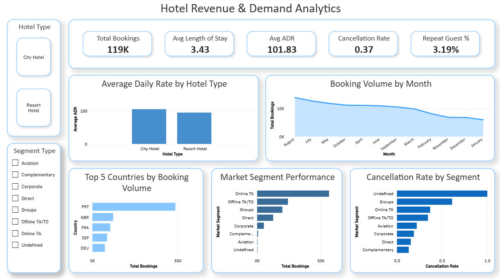
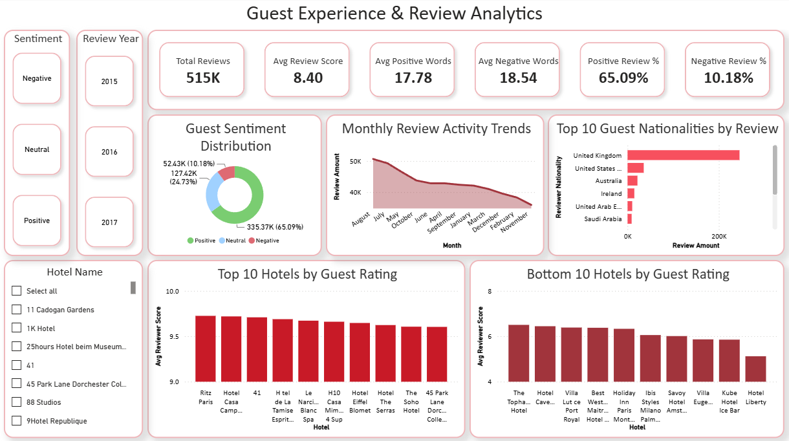
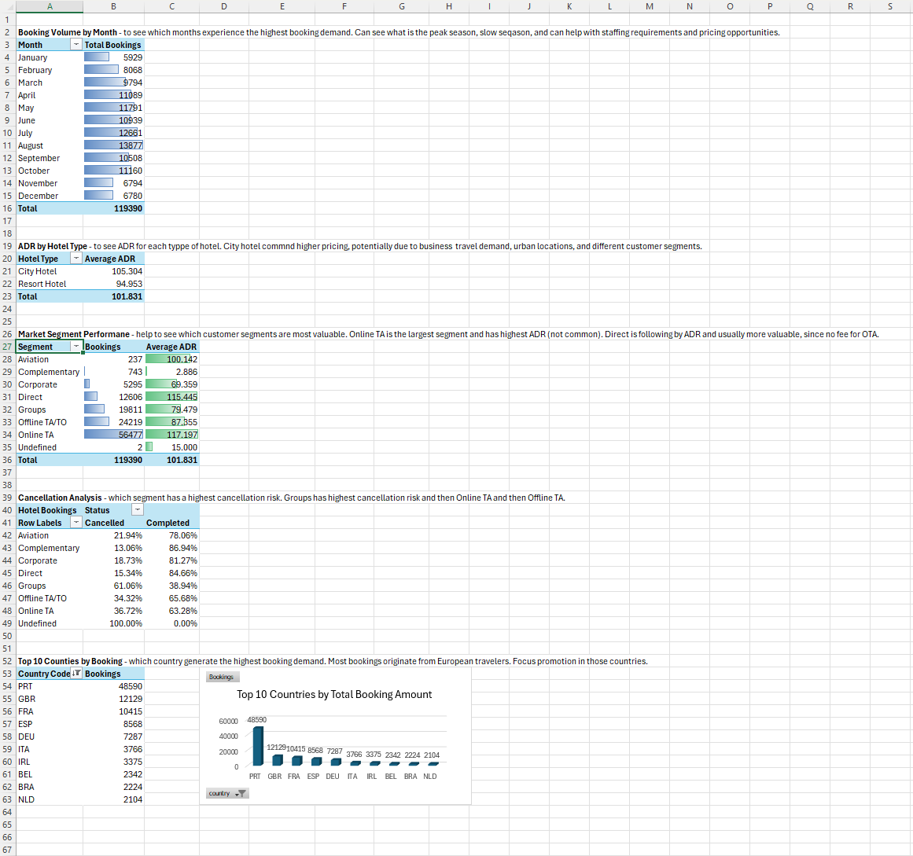
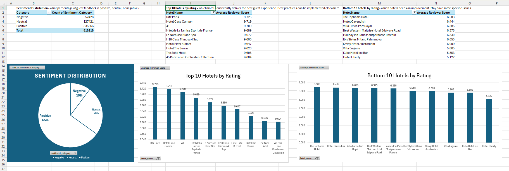
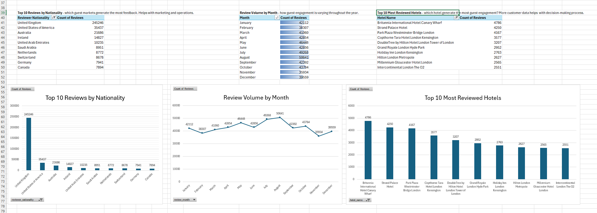
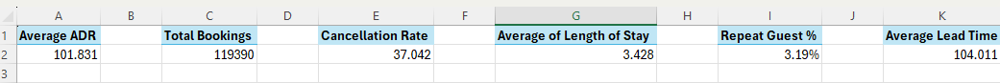
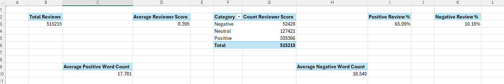

# Hotel Revenue and Guest Experience Analytics

## Overview
This project analyzes hotel booking performance and guest review data to provide insights into revenue generation, operational efficiency, customer behavior, and guest satisfaction. Using Excel and Power BI, the project transforms raw hospitality data into interactive dashboards and business intelligence reports that support data-driven decision-making.

The analysis combines hotel booking data with guest review information to evaluate key performance indicators (KPIs), identify trends, and uncover opportunities to improve both guest experience and financial performance.

This project demonstrates how operational booking data and guest feedback data can be combined to support revenue optimization, customer experience analysis, and hospitality decision-making.

## Tools & Technologies
* Microsoft Excel
* Power Query
* Pivot Tables
* Power BI
* Data Cleaning & Transformation
* Business Intelligence Reporting
  
## Business Objectives
* Understand how the hotel is performing in terms of revenue and bookings.
* Explore trends in occupancy, pricing, and cancellations.
* Get a clearer picture of guest satisfaction through review data.
* Identify which customer groups and market segments perform best.
* Turn insights into practical recommendations that can support better business decisions.

## Project Highlights

* Built interactive Excel and Power BI dashboards using hospitality booking and guest review data.
* Developed KPI dashboards tracking booking volume, ADR, average length of stay, repeat guest rate, cancellation rate, and guest satisfaction metrics.
* Analyzed over 515,000 guest reviews to evaluate customer satisfaction trends.
* Analyzed over 119,000 hotel bookings to uncover revenue opportunities, customer booking trends, and factors impacting cancellations.
* Used Power Query, Pivot Tables, Pivot Charts, and Power BI visualizations to support business decision-making.
* Created dashboards that combine operational performance and guest experience metrics into a unified analytics solution.

## Key Insights

### Hotel Revenue & Demand Analytics

* Analyzed over **119,000 hotel bookings** across City Hotels and Resort Hotels.
* The average length of stay was **3.43 nights** per booking.
* The overall Average Daily Rate (ADR) was **$101.83**.
* The overall cancellation rate reached **37%**, indicating a significant impact on revenue planning and occupancy forecasting.
* Repeat guests represented only **3.19%** of total bookings, suggesting an opportunity to improve customer retention and loyalty programs.
* **Online Travel Agencies (Online TA)** generated the highest booking volume, exceeding **50,000 bookings**, making them the most important acquisition channel.
* **Groups and Online TA** segments experienced elevated cancellation levels.
* Portugal (PRT) generated approximately **49,000 bookings**, making it the largest customer market by booking volume.

### Guest Experience & Review Analytics

* Analyzed over **515,000 guest reviews** across multiple international hotels.
* The average guest review score was **8.40 / 10**, indicating generally strong guest satisfaction.
* **65.09%** of all reviews were classified as positive, while only **10.18%** were classified as negative.
* Positive reviews contained an average of **17.78 words**, while negative reviews averaged **18.54 words**.
* Guests from the **United Kingdom** submitted the largest number of reviews, significantly exceeding all other nationalities.
* The highest-rated hotels achieved average guest scores above **9.6 / 10**, while the lowest-rated hotels scored between **5.1 and 6.5 / 10**, highlighting substantial differences in guest experience across properties.

## Dashboard Screenshots
### Hotel Revenue and Demand Analytics

Interactive Power BI dashboard analyzing 119,000+ hotel bookings. The dashboard tracks booking volume, ADR, average length of stay, average daily rate by hotel type, booking volume by month, market segment performance, cancellation trends, and country-level demand patterns to support revenue management decisions.



### Guest Experience and Review Analytics

Power BI dashboard built from over 515,000 guest reviews. The dashboard evaluates guest satisfaction, sentiment distribution, reviewer demographics, hotel ratings, and review activity trends to identify strengths and opportunities for service improvement.



### Excel Pivot Table Analysis
Pivot table analysis used to explore booking behavior, customer segments, booking channels, cancellations, and guest review trends.





### Excel KPIs
Excel KPI dashboards summarizing booking performance, guest satisfaction metrics, review sentiment, ADR, cancellation rates, and overall business performance.




## Business Impact

This project demonstrates how hospitality organizations can combine operational booking data with guest feedback data to gain a more complete view of business performance. By analyzing both revenue-related metrics and customer satisfaction indicators, decision-makers can identify opportunities to improve occupancy, reduce cancellations, optimize marketing channels, and enhance the overall guest experience.

## Datasets

### Hotel Bookings Dataset
Contains reservation and customer information including:

* Hotel type
* Booking status
* Lead time
* Arrival dates
* Length of stay
* Guest demographics
* Market segments
* Distribution channels
* Average Daily Rate (ADR)
* Customer type
* Reservation status

### Hotel Reviews Dataset
Contains guest review information including:

* Hotel name
* Review date
* Reviewer nationality
* Reviewer score
* Average hotel score
* Positive reviews
* Negative reviews

## Data Preparation
### Excel Data Cleaning and Preparation
Performed extensive data preparation using Excel and Power Query:

* Removed duplicates
* Handled missing values
* Corrected inconsistent data formats
* Standardized categorical values
* Created calculated fields
* Validated data quality

### Data Transformation
Created analytical datasets for reporting and dashboard development by:

* Cleaning booking records
* Preparing review datasets
* Creating KPI calculations
* Building summarized reporting tables
* Generating pivot table analyses

## Excel Skills Demonstrated

* Power Query
* Pivot Tables
* Pivot Charts
* Timeline Filters
* KPI Development
* Conditional Formatting
* Dashboard Design
* Data Cleaning
* Data Transformation

## Power BI Skills Demonstrated

* Interactive Dashboards
* KPI Cards
* Slicers and Filters
* Drill-Down Analysis
* Data Modeling
* Business Intelligence Reporting
* Hospitality Analytics
 
## Project  Structure
```
hotel_revenue_and_guest_experience_analytics/
    README.md
    data/
        hotel_bookings.csv
        hotel_reviews.zip
    excel_screenshots/
        Bookings_KPIs.png
        Bookings_Pivot_Tables.png
        Reviews_KPIs.png
        Reviews_Pivot_Tables.png
        Reviews_Pivot_Tables_2.png
    powerbi/
        booking_and_reviews_dashboards.pbix
    power_bi_screenshots/
        guest_experience_and_review_analytics_screenshot.png
        hotel_revenue_and_demand_analytics_screenshot.png
```

## Repository Notes

Due to GitHub file size limitations, the complete Excel workbook is not included in this repository.
To demonstrate the project workflow and analytical outputs, screenshots of dashboards, KPI summaries, pivot tables, and visualizations are provided.

The hotel reviews raw dataset is included as a compressed ZIP file due to its large size.

If you would like to review the complete Excel workbook, including the interactive dashboards, Power Query transformations, pivot tables, and supporting calculations, please feel free to contact me. I would be happy to share the file or provide a walkthrough of the project upon request.
